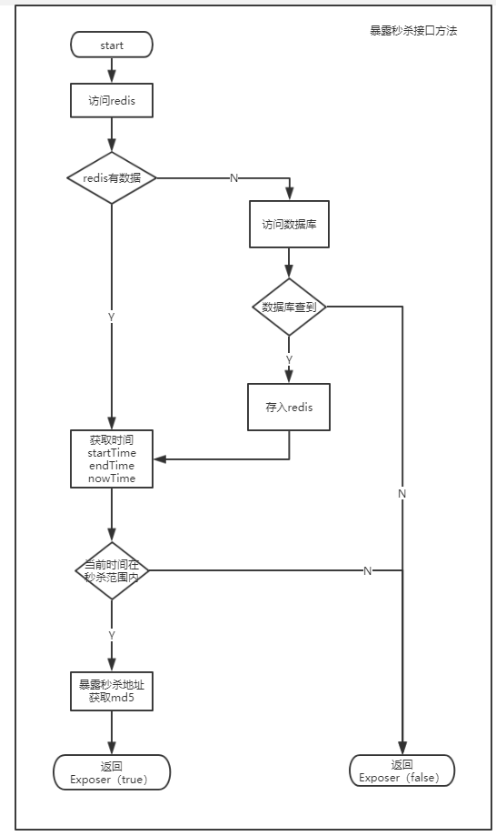
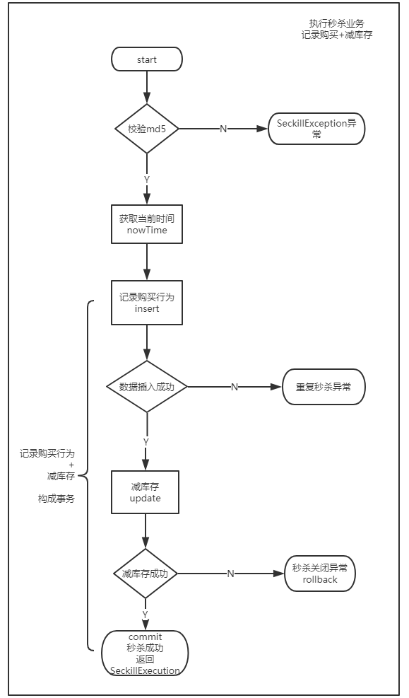
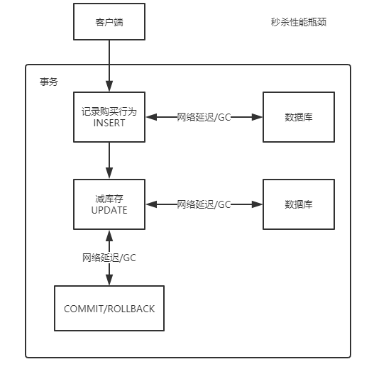

# Simple_seckill
A simple high concurrency seckill system.

## 目录

* [Simple\_seckill](#simple_seckill)
  * [主要功能](#%E4%B8%BB%E8%A6%81%E5%8A%9F%E8%83%BD)
  * [项目主要技术](#%E9%A1%B9%E7%9B%AE%E4%B8%BB%E8%A6%81%E6%8A%80%E6%9C%AF)
  * [数据库表设计](#%E6%95%B0%E6%8D%AE%E5%BA%93%E8%A1%A8%E8%AE%BE%E8%AE%A1)
  * [前端交互逻辑](#%E5%89%8D%E7%AB%AF%E4%BA%A4%E4%BA%92%E9%80%BB%E8%BE%91)
    * [Restful接口设计](#restful%E6%8E%A5%E5%8F%A3%E8%AE%BE%E8%AE%A1)
    * [交互逻辑](#%E4%BA%A4%E4%BA%92%E9%80%BB%E8%BE%91)
  * [后端业务逻辑](#%E5%90%8E%E7%AB%AF%E4%B8%9A%E5%8A%A1%E9%80%BB%E8%BE%91)
  * [秒杀优化分析](#%E7%A7%92%E6%9D%80%E4%BC%98%E5%8C%96%E5%88%86%E6%9E%90)
    * [静态资源](#%E9%9D%99%E6%80%81%E8%B5%84%E6%BA%90)
    * [暴露秒杀地址接口](#%E6%9A%B4%E9%9C%B2%E7%A7%92%E6%9D%80%E5%9C%B0%E5%9D%80%E6%8E%A5%E5%8F%A3)
    * [执行秒杀操作接口](#%E6%89%A7%E8%A1%8C%E7%A7%92%E6%9D%80%E6%93%8D%E4%BD%9C%E6%8E%A5%E5%8F%A3)
      * [<strong>优化分析</strong>](#%E4%BC%98%E5%8C%96%E5%88%86%E6%9E%90)
      * [补充：MySQL的隔离机制](#%E8%A1%A5%E5%85%85mysql%E7%9A%84%E9%9A%94%E7%A6%BB%E6%9C%BA%E5%88%B6)
      * [<strong>瓶颈分析</strong>](#%E7%93%B6%E9%A2%88%E5%88%86%E6%9E%90)
      * [优化思路](#%E4%BC%98%E5%8C%96%E6%80%9D%E8%B7%AF)
      * [其他方案](#%E5%85%B6%E4%BB%96%E6%96%B9%E6%A1%88)
    * [优化总结](#%E4%BC%98%E5%8C%96%E6%80%BB%E7%BB%93)

## 主要功能

- 页面
    - 秒杀商品列表页

    - 秒杀开启页
- 后端功能
    - 暴露秒杀地址接口

    - 秒杀业务执行接口

## 项目主要技术

- 基于maven搭建
- 采用SSM框架整合
- Druid数据库连接池
- 基于注解的声明式事务
- 前端bootstrap+jQuery
- 模块化js
- Redis缓存
- protostuff序列化

## 数据库表设计

sql建表文件存放位置\src\main\sql

```sql
-- 创建数据库
CREATE DATABASE seckill;
-- 使用数据库
use seckill;
-- 创建秒杀库存表
CREATE TABLE `seckill` (
  `seckill_id` bigint(20) NOT NULL AUTO_INCREMENT COMMENT '商品库存id',
  `name` varchar(120) NOT NULL COMMENT '商品名称',
  `number` int(11) NOT NULL COMMENT '库存数量',
  `start_time` timestamp NOT NULL DEFAULT '1970-01-01 12:00:00' COMMENT '秒杀开启时间',
  `end_time` timestamp NOT NULL DEFAULT '1970-01-01 12:00:00' COMMENT '秒杀结束时间',
  `create_time` timestamp NOT NULL DEFAULT CURRENT_TIMESTAMP COMMENT '创建时间',
  PRIMARY KEY (`seckill_id`),
  KEY `idx_start_time` (`start_time`),
  KEY `idx_end_time` (`end_time`),
  KEY `idx_create_time` (`create_time`)
) ENGINE=InnoDB AUTO_INCREMENT=1004 DEFAULT CHARSET=utf8 COMMENT='秒杀库存表';
 
-- 秒杀成功明细表
-- 用户登录认证相关的信息
CREATE TABLE `success_killed` (
  `seckill_id` bigint(20) NOT NULL COMMENT '秒杀商品id',
  `user_phone` varchar(20) NOT NULL COMMENT '用户手机号',
  `state` tinyint(4) NOT NULL DEFAULT '-1' COMMENT '状态标示:-1:无效 0:成功 1:已付款 2:已发货',
  `create_time` timestamp NOT NULL DEFAULT CURRENT_TIMESTAMP ON UPDATE CURRENT_TIMESTAMP COMMENT '创建时间',
  PRIMARY KEY (`seckill_id`,`user_phone`), /*联合主键，防止重复插入*/
  KEY `idx_create_time` (`create_time`)
) ENGINE=InnoDB DEFAULT CHARSET=utf8 COMMENT='秒杀成功明细表';
```

## 前端交互逻辑

### Restful接口设计

```
// 秒杀列表
GET /seckill/list
// 详情页
GET /seckill/{id}/detail
// 系统时间
GET /seckill/time/now
// 暴露秒杀地址
POST /seckill/{id}/exposer
// 执行秒杀
POST /seckill/{id}/{md5}/execution
```

### 交互逻辑

用户访问秒杀商品列表页` /seckill`

客户端请求`url: /seckill/{seckillId}/detail`，

前端控制器处理请求，携带seckill参数并转发到detail页面，

detail页面调用`seckill.detail.init`方法进行初始化工作，显示秒杀倒计时，执行秒杀逻辑等操作

## 后端业务逻辑

- 暴露秒杀接口
    - 先从后端缓存中获取seckill对象，没有则从数据库中查找并放入缓存
    - 获取md5，并返回暴露秒杀地址对象



- 执行秒杀业务

    - 由 记录购买行为 + 减库存 两项操作构成事务

    - 使用Spring声明式事务

        ```mysql
        # 事务开始
        insert ignore into success_killed(seckill_id,user_phone,state)
        values (#{seckillId}, #{userPhone}, 0)
        
        update seckill
        set number = number - 1
        where seckill_id = #{seckillId}
        and start_time &lt;= #{killTime}
        and end_time >= #{killTime}
        and number > 0;
            
        # 事务结束
        ```

    - 秒杀优化行级锁的持有时间



## 秒杀优化分析

### 静态资源

- CDN加速
    - list列表页，js，css等静态资源

### 暴露秒杀地址接口

- 后端Redis缓存

    - 暴露秒杀地址接口中，首先要获取秒杀商品

        由于秒杀商品一般不会改变，因此可以做缓存

    - 超时的基础上维护一致性

### 执行秒杀操作接口

#### **优化分析**

- 无法使用CDN缓存
- 无法使用后端缓存，会造成库存问题
- 热点商品竞争问题
- 行级锁在Commit后释放

#### 补充：MySQL的隔离机制

MySQL默认隔离级别为**可重复读**

事务在读取某数据的瞬间（就是开始读取的瞬间），必须先对其加 **行级共享锁**，直到事务结束才释放；
事务在更新某数据的瞬间（就是发生更新的瞬间），必须先对其加 **行级排他锁**，直到事务结束才释放。

#### **瓶颈分析**

减库存操作和记录购买行为构成了事务，行级锁在commit后提交，优化方向为减少行级锁的持有时间

两种操作间存在网络延迟和GC垃圾收集

网络延迟和GC操作是造成性能瓶颈主要问题



网络延迟：

- 同城机房：0.5-2 ms
- 异地机房：根据地理位置在几十毫秒上下

#### 优化思路

**将客户端逻辑放到MySQL服务端，避免网络延迟和GC影响**

- 使用存储过程：整个事务在MySQL端完成

    Spring中的声明式事务或者手动控制事务都是在客户端完成的，存储过程能够使得事务在服务器端完成，

    有效减少网络延迟和GC的影响

#### 其他方案

- 原子计数器记录商品库存 -> 采用NoSQL实现，例如redis
- 记录行为消息放入消息队列 -> 分布式MQ实现，主流的有rabbitMQ,rocketMQ等
- 消费消息并落地 -> 记录到MySQL中

本方案优点:

- 超高并发量

缺点：

- 运维成本高，稳定性
    - NoSQL和MQ都是分布式服务，运维成本很高
- 开发成本：数据一致性，回滚方案等
    - 工程师要非常熟悉这些组件
- 难以保证幂等性：重复秒杀问题
    - 需要专门维护NoSQL方案记录重复秒杀用户

### 优化总结

- 前端控制：暴露接口，防止重复点击
- 动静分离：CDN缓存，后端Redis缓存
- 事务竞争优化：减少行级锁持有时间
